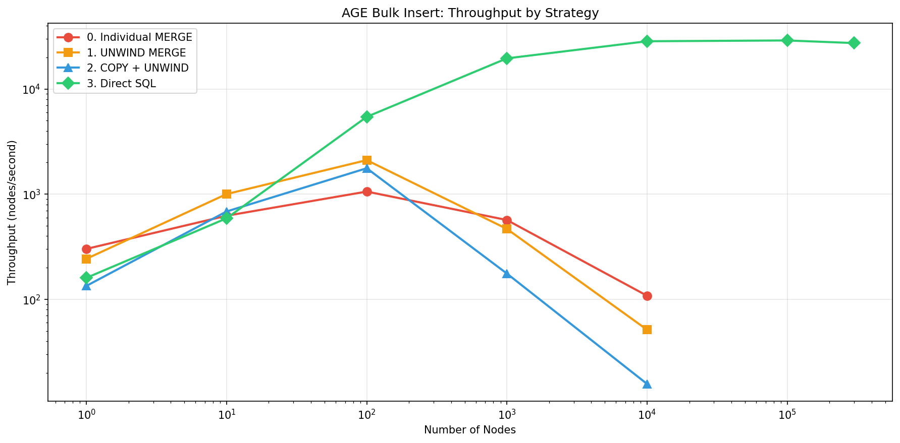
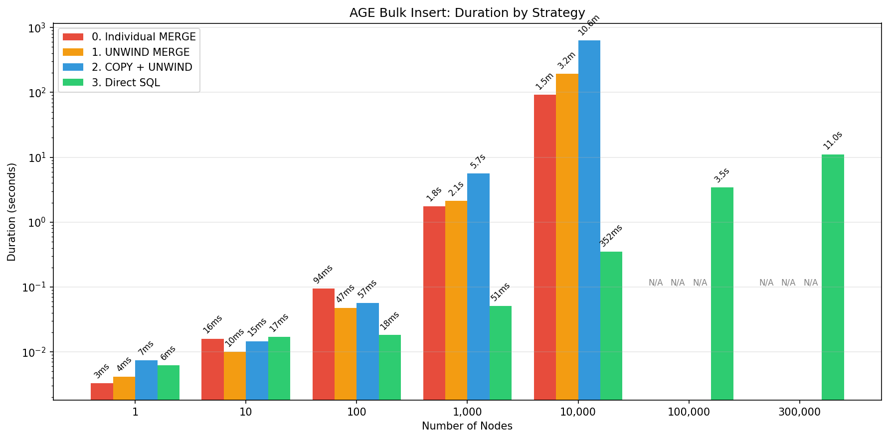

# Optimizing Bulk Insert with Apache AGE

While building our experimental knowledge graph platform, [Kartograph](https://github.com/openshift-hyperfleet/kartograph), we ran into significant performance issues when inserting >10K nodes into [Apache AGE](https://age.apache.org/) (a PostgreSQL graph extension).

This repo documents our journey optimizing bulk loading, moving through four strategies from simple to complex. We also provide a benchmark script so you can reproduce the results on your own hardware.

---

## The Approaches

This benchmark repo aims to mirror our setup in Kartograph as closely as possible. 
Database queries are made via Python script to a Postgres docker container. Notably,
this prevents us from using file-based bulk loading strategies (like from CSV).

Each benchmark run inserts N nodes plus N-1 edges (forming a chain). So "10k nodes" actually means inserting ~20k entities.

### Strategy 0: Individual MERGE

We started here with the naive approach, executing a cypher query
for every node creation.

```python
for node in nodes:
    cursor.execute(f"""
        SELECT * FROM cypher('graph', $$ 
            MERGE (n:Person {{id: '{node.id}'}}) SET n = {props}
        $$) AS (n agtype)
    """)
```

This works fine for small datasets. On 1K nodes, we get about ~560 nodes/second, or about 2 seconds total.
The problem is that performance doesn't scale linearly with node count. 

At 10k nodes, this strategy takes about 1.5 minutes.

### Strategy 1: UNWIND Batching

The logical next step was to move towards strategies that batch inserts.

Cypher's UNWIND lets you process an array of items in a single query:

```python
items = "[{id: '1', name: 'Alice'}, {id: '2', name: 'Bob'}, ...]"
cursor.execute(f"""
    SELECT * FROM cypher('graph', $$ 
        UNWIND {items} AS item
        MERGE (n:Person {{id: item.id}}) SET n = item
    $$) AS (n agtype)
""")
```

This reduces round trips for a given batch to one, which helps for moderate batch sizes.

However, at larger scales the Cypher parser appears to become the bottleneck.*

Query strings with thousands of items take longer to parse than the individual approach. 

At 10k nodes, this actually takes longer than Strategy 0 at ~3 minutes (around twice as slow).

_*We aren't entirely sure where the slowdown is coming from, as we did not have time to dig into the internals of Apache AGE._

### Strategy 2: COPY + UNWIND

We thought that the data transfer itself may be a bottleneck, causing the Cypher queries 
to be slow. We theorized that we could reduce the effect of the data transfer
by using PostgreSQL's COPY protocol to first load the data into a staging table, and
then use batched UNWIND cypher queries.

```python
cursor.copy_from(buffer, "staging", columns=["id", "properties"])
for batch in fetch_batches("staging", size=200):
    cursor.execute(build_unwind_query(batch))
```

This approach was actually slower than the regular UNWIND cypher query, invalidating our hypothesis about 
the data transfer bottleneck. In hindsight, this makes sense, as we still are running cypher for each batch. 

At 10k nodes, this strategy took over 10 minutes (around 6x slower than Strategy 0).


### Strategy 3: Direct SQL

At this point we had, to our knowledge, exhausted every optimization technique that interacted with Apache AGE via cypher query.

However, we came across [agefreighter](https://github.com/rioriost/agefreighter) which claims to load
10M nodes into a remote Postgres database in ~512 seconds.

Looking into how they achieve this, we saw that they directly interacted with the Postgres tables that
Apache AGE uses to store nodes and edges.

AGE stores graph data in regular PostgreSQL tables, and each label gets its own table (e.g., `"graph"."Person"`) that inherits from `_ag_label_vertex`. You can query these tables directly:

```sql
SELECT * FROM ag_catalog.ag_label;  -- label metadata (id, sequence name)
SELECT * FROM "my_graph"."Person";  -- actual node data
```

Node tables have two columns: `id` (a graphid) and `properties` (agtype, similar to JSONB). Since we know the schema, we can bypass
the cypher overhead and use INSERT directly:

```python
cursor.copy_from(buffer, "staging", columns=["id", "properties"])
cursor.execute("""
    INSERT INTO "graph"."Person" (id, properties)
    SELECT 
        ag_catalog._graphid(label_id, nextval(seq)),  -- compute graphid
        properties::agtype
    FROM staging
    WHERE NOT EXISTS (...)
""")
```

Finally, we saw a dramatic performance increase. 

At 10k nodes, this strategy takes ~433 milliseconds to execute (~230x faster than Strategy 0).

> [!Warning]
>
> While the performance of this approach is extremely exciting, it comes with some potentially
> significant "gotchas".
>
> Inserting data this way relies on a private interface that is not guaranteed to be stable
> by the Apache AGE project. Updates to Apache AGE may break this approach.
>
> Node and edge tables are lazily created by Apache AGE when cypher queries are used. This is
> not true for direct inserts. To reduce the fragility of this approach, we chose to create a
> single edge/node of a given label using cypher before doing the direct insert. This allowed
> Apache AGE to perform the label table bootstrapping for us.
> 
> Further, one must take special care to ensure that IDs are properly generated via the 
> Postgres sequence, and that the sequence is properly incremented after use.
>
> Finally, special care is also required to ensure the properties data is formatted correctly,
> and that edges are not orphaned since Apache AGE doesn't enforce foreign key constraints for
> performance reasons.
>
> We have done our best to address each of these issues in Kartograph, as well as the examples
> in this repository. However, we make no guarantees about the correctness of our approach.

---

## Results

| Approach | 10k nodes | Notes |
|----------|-----------|-------|
| Individual MERGE | 1m 39s | N roundtrips, N query parses |
| UNWIND batch | 3m 19s | Single query, but parser struggles with large inputs |
| COPY + UNWIND | 10m 29s | Fast staging, but still Cypher-bound |
| Direct SQL | 433ms | Bypasses Cypher, writes to AGE tables directly |



<details>
<summary>Full benchmark table</summary>

```
┏━━━━━━━━━━━━━━━━━━━━━┳━━━━━━━━━┳━━━━━━━━━━┳━━━━━━━━━━━┳━━━━━━━━━━━━┳━━━━━━━━━━━━━┓
┃ Strategy            ┃ 1 nodes ┃ 10 nodes ┃ 100 nodes ┃ 1000 nodes ┃ 10000 nodes ┃
┡━━━━━━━━━━━━━━━━━━━━━╇━━━━━━━━━╇━━━━━━━━━━╇━━━━━━━━━━━╇━━━━━━━━━━━━╇━━━━━━━━━━━━━┩
│ 0. Individual MERGE │   3.3ms │     16ms │      94ms │      1.76s │      1m 39s │
│ 1. UNWIND MERGE     │   4.1ms │     10ms │      47ms │      2.14s │      3m 19s │
│ 2. COPY + UNWIND    │   7.4ms │     15ms │      57ms │      5.68s │     10m 29s │
│ 3. Direct SQL       │   5.6ms │     16ms │      20ms │       51ms │       433ms │
└─────────────────────┴─────────┴──────────┴───────────┴────────────┴─────────────┘
```

</details>

<details>
<summary>More charts</summary>

> [!Note]
>
> For the 100k and 300k runs, we did not run the other strategies due to 
> extremely long execution times. We felt that the numbers up to 10k were 
> sufficient to tell the story. 
>
> If you run with a more capable machine or with more patience, we'd love 
> to see more data about how these strategies scale!




</details>

_Benchmarks run on: Intel Core Ultra 9 185H (16 cores), 64GB RAM, Fedora 42, PostgreSQL in Docker_

---

## When to Use What

| Situation | Recommendation |
|-----------|---------------|
| Interactive operations (1-10 entities) | Individual MERGE is simple and fast enough |
| Moderate batches (10-100 entities) | UNWIND reduces roundtrips without parser issues |
| Bulk loading (1000+ entities) | Direct SQL is the only approach that scales well |


---

## Try It Yourself

```bash
docker compose up -d
uv sync
uv run python -m benchmarks.run_all --sizes 100,1000,5000

# Generate Graphs
uv run python -m benchmarks.visualize benchmarks/results/benchmark_*.json
```

---

## Project Structure

```
src/strategies/
├── s0_individual_merge.py
├── s1_unwind_merge.py
├── s2_copy_unwind.py
└── s3_direct_sql.py

benchmarks/
├── run_all.py
└── visualize.py
```

## References

- [Apache AGE Documentation](https://age.apache.org/age-manual/master/index.html)
- [AGE GitHub](https://github.com/apache/age)
- [PostgreSQL COPY Protocol](https://www.postgresql.org/docs/current/sql-copy.html)

## License

MIT
